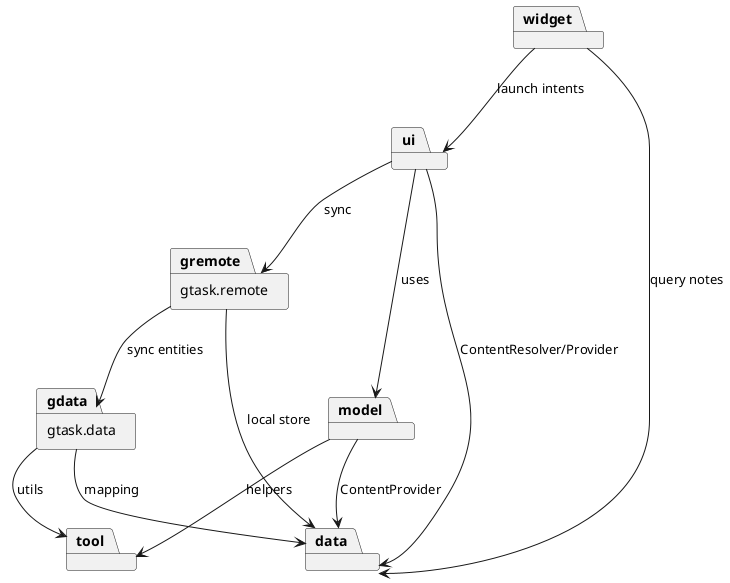
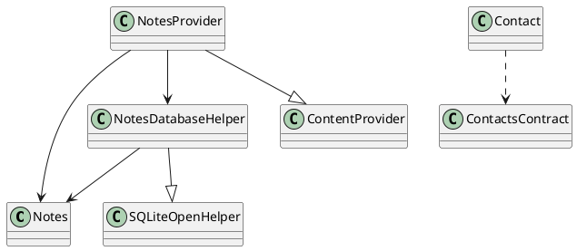
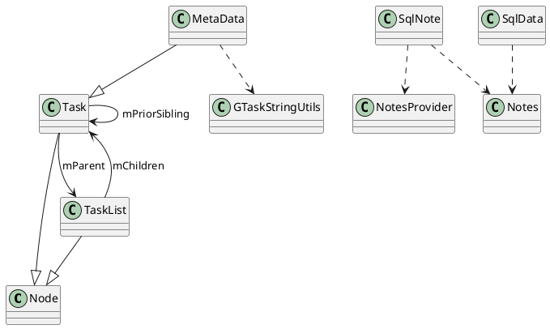
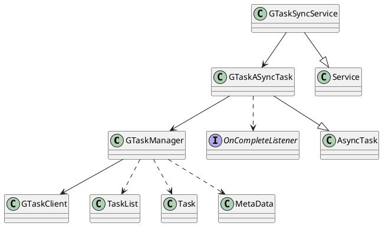
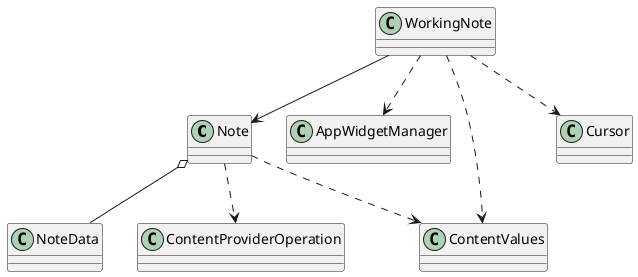
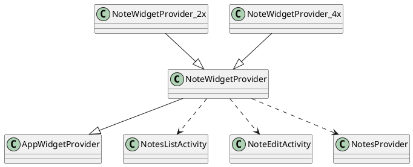
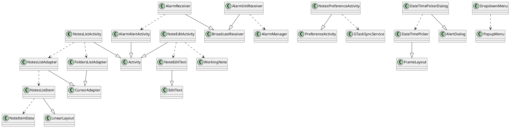

# 图1. 小米便签体系结构图

```plantuml
@startuml
skinparam packageStyle rectangle

package "ui" as ui
package "widget" as widget
package "model" as model
package "data" as data
package "gtask.data" as gdata
package "gtask.remote" as gremote
package "tool" as tool

ui --> model : uses
ui --> data : ContentResolver/Provider
ui --> gremote : sync
widget --> ui : launch intents
widget --> data : query notes
model --> data : ContentProvider
model --> tool : helpers

gdata --> data : mapping

gremote --> gdata : sync entities

gremote --> data : local store

gdata --> tool : utils

@enduml
```

# 图2. data程序包的实现类图

```plantuml
@startuml

class Notes
class NotesProvider
class NotesDatabaseHelper
class Contact

NotesProvider --|> ContentProvider
NotesDatabaseHelper --|> SQLiteOpenHelper

NotesProvider --> NotesDatabaseHelper
NotesProvider --> Notes
NotesDatabaseHelper --> Notes
Contact ..> ContactsContract

@enduml
```

# 图3. gtask.data程序包的实现类图

```plantuml
@startuml

class Node
class Task
class TaskList
class MetaData
class SqlNote
class SqlData

Task --|> Node
TaskList --|> Node
MetaData --|> Task

Task --> TaskList : mParent
Task --> Task : mPriorSibling
TaskList --> Task : mChildren
SqlNote ..> Notes
SqlNote ..> NotesProvider
SqlData ..> Notes
MetaData ..> GTaskStringUtils

@enduml
```

# 图4. gtask.remote程序包的实现类图

```plantuml
@startuml

class GTaskManager
class GTaskClient
class GTaskASyncTask
class GTaskSyncService
interface OnCompleteListener

GTaskASyncTask --|> AsyncTask
GTaskSyncService --|> Service
GTaskASyncTask ..> OnCompleteListener

GTaskASyncTask --> GTaskManager
GTaskManager --> GTaskClient
GTaskSyncService --> GTaskASyncTask
GTaskManager ..> TaskList
GTaskManager ..> Task
GTaskManager ..> MetaData

@enduml
```

# 图5. model程序包的实现类图

```plantuml
@startuml

class Note
class WorkingNote

Note o-- NoteData
WorkingNote --> Note
WorkingNote ..> AppWidgetManager
WorkingNote ..> ContentValues
WorkingNote ..> Cursor
Note ..> ContentProviderOperation
Note ..> ContentValues

@enduml
```

# 图6. widget程序包的实现类图

```plantuml
@startuml

class NoteWidgetProvider
class NoteWidgetProvider_2x
class NoteWidgetProvider_4x

NoteWidgetProvider --|> AppWidgetProvider
NoteWidgetProvider_2x --|> NoteWidgetProvider
NoteWidgetProvider_4x --|> NoteWidgetProvider

NoteWidgetProvider ..> NotesListActivity
NoteWidgetProvider ..> NoteEditActivity
NoteWidgetProvider ..> NotesProvider

@enduml
```

# 图7. ui程序包的实现类图

```plantuml
@startuml

class NotesListActivity
class NoteEditActivity
class AlarmAlertActivity
class AlarmReceiver
class AlarmInitReceiver
class NotesListAdapter
class NoteEditText
class NotesPreferenceActivity
class DateTimePicker
class DateTimePickerDialog
class FoldersListAdapter
class NotesListItem
class NoteItemData
class DropdownMenu

NotesListActivity --|> Activity
NoteEditActivity --|> Activity
AlarmAlertActivity --|> Activity
AlarmReceiver --|> BroadcastReceiver
AlarmInitReceiver --|> BroadcastReceiver
NotesListAdapter --|> CursorAdapter
NoteEditText --|> EditText
NotesPreferenceActivity --|> PreferenceActivity
DateTimePicker --|> FrameLayout
DateTimePickerDialog --|> AlertDialog
NotesListItem --|> LinearLayout
FoldersListAdapter --|> CursorAdapter

NoteEditActivity ..> NoteEditText
NoteEditActivity ..> WorkingNote
NotesListActivity ..> NotesListAdapter
NotesListActivity ..> FoldersListAdapter
NotesListAdapter ..> NotesListItem
NotesListItem ..> NoteItemData
DateTimePickerDialog ..> DateTimePicker
NotesPreferenceActivity ..> GTaskSyncService
AlarmReceiver ..> AlarmAlertActivity
AlarmInitReceiver ..> AlarmManager
DropdownMenu ..> PopupMenu

@enduml
```
